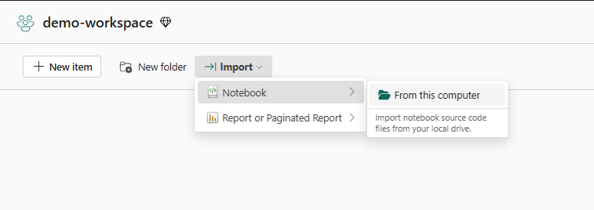
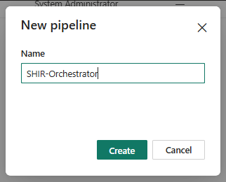
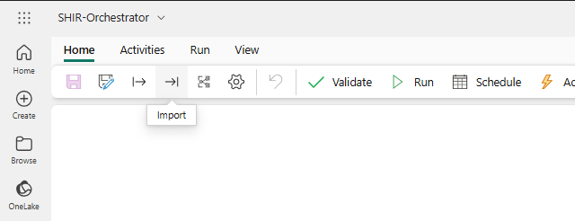
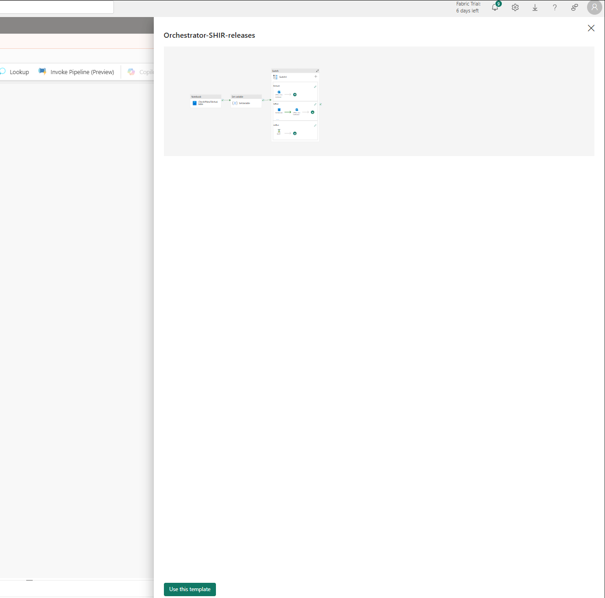
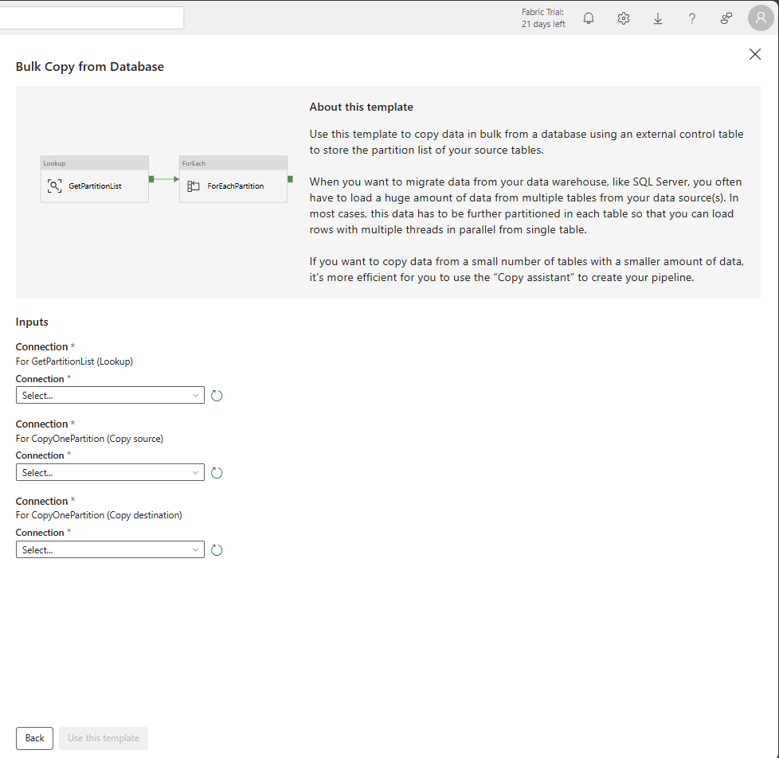
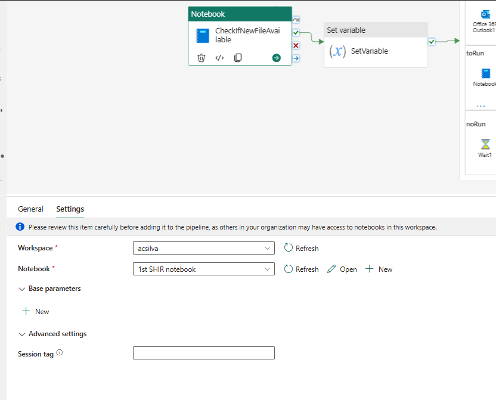
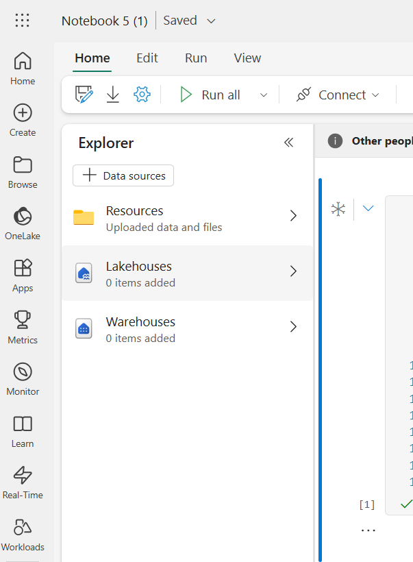
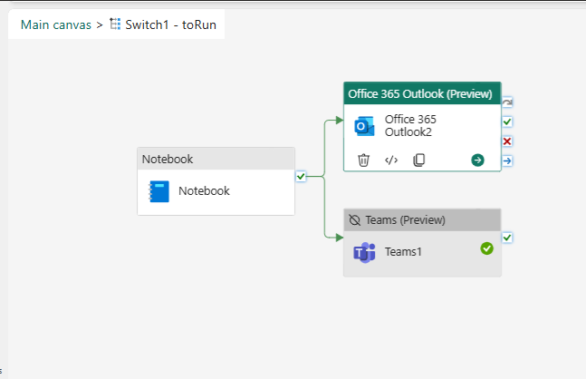
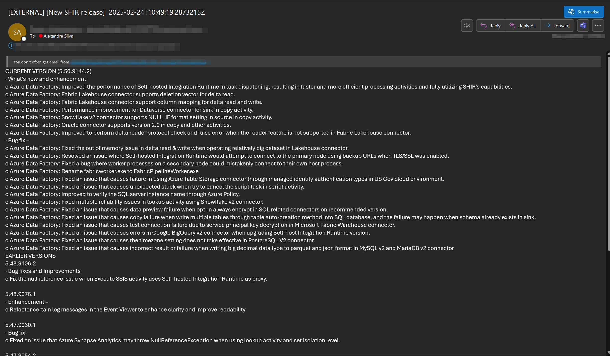

# shir-releases

This projects describes an automation to use Microsoft Fabric to get notified about new Azure Data Factory (and Azure Synapse Analytics) SHIR releases, and to have delivered via email/ms teams its content.

*Pseudo logic:*
1. Download SHIR notes (https://www.microsoft.com/en-us/download/details.aspx?id=39717) into a MS Fabric lakehouse
2. The file is hashed and based on that it is decided whether we are processing a new file
3. If it is a new file, the content is parsed. If it is not. Skip.

## Steps  
1. Import 2 notebooks, by using the UI experience, to your workspace  

2. Create a Data pipeline to orchestrate the logic  

3. Import the pipeline template  (pipeline-to-orchestrate.zip)
  
This is how it looks like:  

I hope in the future we are able to customize our templates, like the ones from the official template gallery - this would offer a great wa of parameterizing templates:  

4. Assign each notebook to its activity:
    
    4.1. Activity "CheckIfNewFileAvailable" should use the "1st SHIR notebook";   
    4.2 Activity "Notebook" should use the "Notebook 5(1)"  

5. Within each notebook, associate the desired Lakehouse, on the Left handside, explorer, either add a pre-existing one or create a brand new. Just have in mind, if you create a new one, to assign it to both notebooks.  

6. The next step is to sign in to the Outlook or MS Teams activity. This process creates a connection for the activity. Once you have a connection setup, you can change the email fields, for instance.
  
It's in this step that you can select the subject, for instance:  
@concat('[New SHIR release]  ', utcNow())  

    and the email body:  
@{activity('Notebook').output.result.exitValue}

## Example of the outcome:

## Scheduling thoughts
For my use case, it's not critical to know on the second when there's a new SHIR release.

This pipeline runs in my environment every 12 hours, and I believe that's enough, it could even go with running once a day. 
